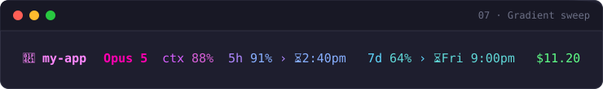
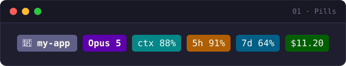
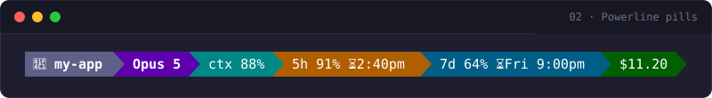
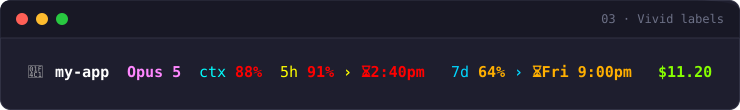
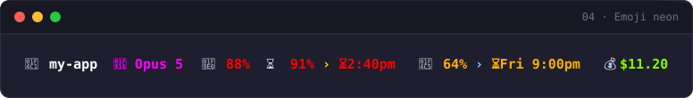
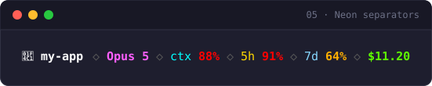
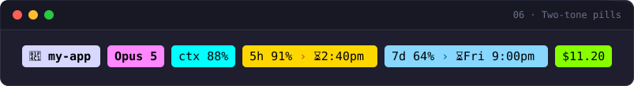

<div align="center">

# 🎨 claude-code-statusline

**Seven colorful, drop-in status lines for [Claude Code](https://claude.com/claude-code).**
<br/>One line to install. Nothing to configure.

<p>
  
  
  
  
  
</p>



</div>

## What it shows

Every theme renders one compact line with the six things worth watching while you work:

```
📁 project · model · ctx% · 5h% + reset time · 7d% + reset time · $cost
```

| Field | Meaning |
| :-- | :-- |
| `📁 project` | current working directory |
| `model` | active model (for example, Opus 5) |
| `ctx%` | context window used |
| `5h%` | 5-hour rate-limit window used, plus a `·` then the local time it resets (day added if not today) |
| `7d%` | 7-day rate-limit window used, plus a `·` then the day and time it resets |
| `$cost` | session cost so far |

Values shade from green to amber to red as usage climbs, so the line tells you when to slow down at a glance.

## Install

```sh
curl -fsSL https://raw.githubusercontent.com/shyam-pareek/claude-code-statusline/main/install.sh | bash
```

Pick a theme from the menu, open a fresh Claude Code session, and you are set. Re-run anytime to switch.

Prefer a specific theme with no prompt? Pass its number:

```sh
curl -fsSL https://raw.githubusercontent.com/shyam-pareek/claude-code-statusline/main/install.sh | THEME=4 bash
```

## The seven themes

Each preview uses a sample session. Install any one by number with `THEME=N`.

### 1 · Pills
Solid rounded pills, one hue per metric. Clean and highly readable.

<p align="center"></p>

### 2 · Powerline pills
Seamless arrow-joined segments. Needs a [Nerd Font](https://www.nerdfonts.com) for the arrow glyphs.

<p align="center"></p>

### 3 · Vivid labels
A bright label per metric; the numbers shade green → amber → red as usage climbs.

<p align="center"></p>

### 4 · Emoji neon
Emoji markers with bold, neon percentages.

<p align="center"></p>

### 5 · Neon separators
Bright model, colored labels, dim diamond separators between fields.

<p align="center"></p>

### 6 · Two-tone pills
Bright backgrounds with dark text. The loudest, highest-presence set.

<p align="center"></p>

### 7 · Gradient sweep
Hue glides pink → purple → blue → green across the whole line.

<p align="center"></p>

> Previews use a sample project. On your machine the fields reflect your real session.

## Requirements

| Need | Notes |
| :-- | :-- |
| [Claude Code](https://claude.com/claude-code) | the status line is a Claude Code feature |
| [`jq`](https://jqlang.github.io/jq/) | parses the status JSON. `brew install jq` · `sudo apt-get install -y jq` · `sudo dnf install -y jq` |
| A Nerd Font | only for theme 2 (Powerline pills), for its arrow glyphs |
| 256-color terminal | virtually every modern terminal qualifies |

## Customize

Each theme is one self-contained script with a tiny config block at the top:

```sh
SHOW_PROJECT=true    # leading 📁 project name
SHOW_COST=true       # trailing $cost
```

Flip either to `false` and re-run, or let the installer set them for you:

```sh
SHOW_PROJECT=false SHOW_COST=false ./install.sh
```

Colors are plain [xterm-256 codes](https://www.ditig.com/256-colors-cheat-sheet) (`38;5;N` foreground, `48;5;N` background). Edit the numbers in `~/.claude/statusline/statusline.sh` to taste.

<details>
<summary><b>Try it locally before installing</b></summary>

Clone the repo and preview all seven with sample data:

```sh
git clone https://github.com/shyam-pareek/claude-code-statusline
cd claude-code-statusline
./preview.sh
```

Then install your pick straight from the clone:

```sh
./install.sh            # interactive
THEME=4 ./install.sh    # or straight to a theme
```

</details>

<details>
<summary><b>What the installer does</b></summary>

1. Checks that `jq` is present.
2. Copies your chosen theme to `~/.claude/statusline/statusline.sh`.
3. Backs up `~/.claude/settings.json` to `settings.json.bak-<timestamp>` if it exists.
4. Sets **only** the `.statusLine` key via `jq`, leaving every other setting untouched:

```json
{
  "statusLine": {
    "type": "command",
    "command": "bash ~/.claude/statusline/statusline.sh"
  }
}
```

</details>

<details>
<summary><b>How it works</b></summary>

Claude Code feeds a JSON blob about the current session to your status-line command on **stdin**, and the command prints **one line** to stdout. These themes read fields like `.workspace.current_dir`, `.model.display_name`, `.context_window.used_percentage`, `.rate_limits.five_hour.used_percentage`, `.rate_limits.seven_day.used_percentage`, and `.cost.total_cost_usd`, then paint them with ANSI colors. Missing fields degrade gracefully to `?` / `0%` / `$0.00`.

See the Claude Code [status line docs](https://docs.claude.com/en/docs/claude-code/statusline) for the full schema.

</details>

<details>
<summary><b>Uninstall</b></summary>

```sh
tmp=$(mktemp); jq 'del(.statusLine)' ~/.claude/settings.json > "$tmp" && mv "$tmp" ~/.claude/settings.json
rm -rf ~/.claude/statusline
```

Or just restore one of the `settings.json.bak-*` backups.

</details>

## Contributing

New color schemes are welcome. Copy any `themes/NN-*.sh`, restyle the render section, keep the config block and the graceful-fallback preamble, add a preview, and open a PR. Issues welcome too.

<div align="center">
<sub>

**[MIT](LICENSE)** © 2026 Shyam Pareek

</sub>
</div>
